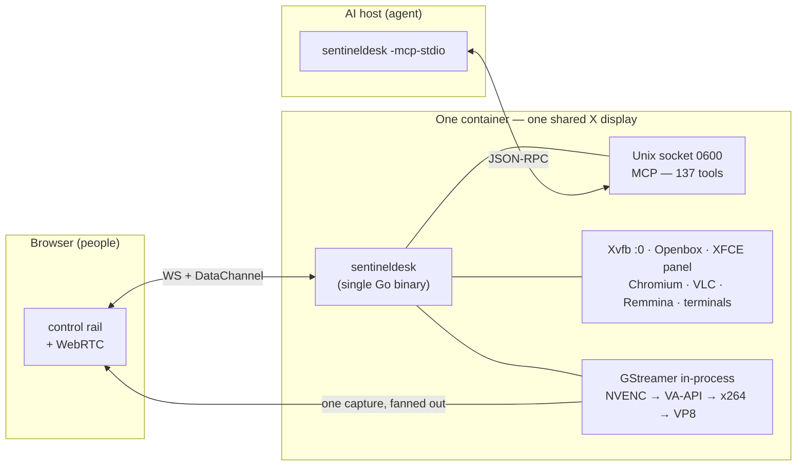

# SentinelDesk — a collaborative desktop for people and AI agents

A complete Linux desktop that runs **inside a Docker container with no physical
monitor**, streams to the browser over **WebRTC**, and is driven at the same
time by people and by an AI agent that sees and acts on the *same* X display.

**This is a standalone, self-contained product.** One `docker compose up` gives
a full desktop that people and an agent share — no control plane, no database,
nothing else to stand up. It is for anyone who wants a collaboration environment for
humans and machines and nothing more.

> Running a *fleet* of these desktops behind a single front desk — a room
> manager with accounts, scheduling and per-room lifecycle — is a **separate
> project in its own repository**. This one does not need it and does not depend
> on it; the two are being kept apart on purpose while the split is finished.

**📖 Documentation** — the full user guide and reference are published from this
repository with GitHub Pages: **<https://sentineldesk.github.io/desktop/docs/guide/index.html>**
(English, Spanish and Portuguese). It is where the **Docs** button in the
desktop's rail goes.



## Why it exists

The AI agent is a **participant**, not an API bolted to the side. It shares the
screen people are looking at:

- **They take turns.** Control is claimed, never assumed — by anybody, the agent
  included, and whether or not somebody is watching. Nobody holds the controls
  until they ask; asking while someone is driving puts a prompt on their screen
  with a timer, and no answer means no.
- **They read the same state.** Every command runs in a terminal window on the
  shared screen and reports its exit status, whoever typed it — so a person can
  hit an error, ask the agent to look, and the agent reads what actually
  happened rather than being told about it.
- **Nothing runs off-screen.** The agent's only reach is the MCP socket, and
  everything it does lands in a window the room can see. A cage nobody is
  looking into is just a smaller room.
- **One capture, many observers.** The screen is encoded once and fanned out to
  every browser, the recorder and any live stream. A second viewer costs
  bandwidth, not CPU.

People drive it through a control layer in the browser. The agent drives it
through a local Unix socket with **134 MCP tools**. Neither is a guest of the
other.

## Quick start

You do **not** need to clone this repository to use it — the image is published
on Docker Hub as `cnsoluciones/sentineldesk`, and it runs the same way
everywhere: a VPS, a Raspberry Pi (arm64), or your laptop. The only thing on
the host is Docker.

### Easiest: the installer

On a Linux host it installs Docker if it is missing, pulls the image, and starts
the desktop in the background:

```bash
curl -fsSL https://raw.githubusercontent.com/sentineldesk/desktop/main/install.sh | sudo bash
# add --full for the heavier apps, --pass <p> to set the password,
# --ip <addr> on a public VPS. Run with --help to see all options.
```

### Two services, one command

The desktop and the agent are **two containers**, and compose is how they are
run. Download the file and bring it up — no clone, no build:

```bash
curl -fsSLO https://raw.githubusercontent.com/sentineldesk/desktop/main/docker-compose.yml
AUTH_PASS=change-me HOST_IP=<your-ip> docker compose up -d
# → open https://<your-ip>:8080 and log in
```

`HOST_IP` is the address browsers reach this host at — its LAN address, or the
public IP on a VPS. Off localhost it is required rather than optional: WebRTC
would otherwise advertise the container's bridge address, which nothing outside
can reach, and the video connects and stays black.

That is the whole install. What it starts:

| service | container | what it is |
|---|---|---|
| `sentineldesk` | `sentineldesk` | the desktop: X, the browser, the apps, the WebRTC stream, the MCP server |
| `agent` | `sentineldesk-agent` | the runtime that drives it — the brain behind the chat panel |

**The agent is optional, and naming the desktop is how you say so:**

```bash
docker compose up -d                # the desktop and an agent beside it
docker compose up -d sentineldesk   # the desktop, on its own
```

The desktop has no `depends_on` and no link to the agent, so the second line is
a complete deployment rather than a crippled one. Order does not matter either:
started first, the agent waits for the desktop and reconnects when it comes
back.

### How the two are joined

One volume, and it is worth understanding because it is the whole security
story:

```
sentineldesk-run   ──  a directory of Unix sockets, mounted in both
```

That is the **only** link between them. The agent has no ports, no network of
its own, and no route to the desktop except that socket — so nothing about the
conversation, or what the agent does, leaves the host. It also means the agent
can only do what the socket grants, which is why there is one security boundary
here rather than two.

The other volumes keep state across restarts and upgrades:

| volume | holds |
|---|---|
| `sentineldesk-home` | browser profiles, files, the TLS certificate |
| `sentineldesk-audit` | the action log — kept apart, so wiping a profile never takes the record with it |
| `sentineldesk-agent` | the agent's model choice, keys and history |
| `sentineldesk-work` | scratch space for screenshots and recordings in flight |

`sentineldesk-agent` is not optional if you want the agent to remember its
model: without it the container is replaced and the preference goes with it.

### Everyday commands

```bash
docker compose ps                      # what is up
docker compose logs -f sentineldesk    # follow the desktop
docker compose logs -f agent           # follow the agent
docker compose restart agent           # restart one service
docker compose down                    # stop both, keep the volumes
docker compose pull && docker compose up -d    # upgrade in place
```

`docker compose down` leaves the volumes alone, so the home, the audit log and
the agent's keys survive it. To start genuinely fresh, remove them by name —
and read that as the destructive command it is:
`docker volume rm sentineldesk-home sentineldesk-agent`.

### Configuring it

Compose reads a `.env` beside the file, which is the tidier place for anything
you would otherwise repeat on the command line:

```bash
cat > .env <<'EOF'
AUTH_USER=admin
AUTH_PASS=a-real-password
HOST_IP=192.168.0.100
SENTINELDESK_TAG=latest        # or `full` for the heavier apps
TZ=America/Argentina/Buenos_Aires
KEYBOARD_LAYOUT=latam
HTTP_PORT=8080
EOF
docker compose up -d
```

Every one of those has a default; only `AUTH_PASS` and `HOST_IP` really want
setting before anybody else can reach the deployment.

**A relay for hostile networks.** Peer-to-peer fails on symmetric NAT and where
UDP is dropped. A TURN service is in the file and off by default, because a
relay carries every frame through it and paying that when nobody needs it is the
wrong trade:

```bash
docker compose --profile turn up -d
```

Set `CLIENT_TURN_URLS` on the desktop when it is running, or browsers are never
told the relay exists.

**Built-in VPN.** The desktop can dial OpenVPN, which needs a tunnel device and
the capability to configure routes. Both are commented out in the compose file —
uncomment `cap_add: NET_ADMIN` and `devices: /dev/net/tun` on the `sentineldesk`
service. `NET_ADMIN` lets the container manage its own network stack, so leave
it off on a deployment that will never dial one.

### Picking a model

The agent comes up with no key, which is deliberate: the socket is what it needs
to start, and the key is what `/connect` is for. Open a session in its container
and type it there:

```bash
docker exec -it sentineldesk-agent sentineldesk-agent
# then: /connect
```

The chat panel in the browser goes from amber to green on its own — nothing to
reload. See [the TUI](docs/guide/#tui) for everything you can type in that
session.

Set `AGENT_ENABLED=0` on the desktop to turn the whole agent plane off, panel
included.

### Running the agent on the host instead

A third arrangement needs nothing in the compose file. The agent finds the
socket in the `sentineldesk-run` volume by itself:

```bash
docker compose up -d sentineldesk   # the desktop only
sentineldesk-agent -serve           # the agent, on the host
```

This is the lightest way to work while you are *changing* the agent — no image
to rebuild between edits. Do not run both: two runtimes on one desktop means the
newer connection wins and the older is dropped. Nothing breaks; it is just
confusing. Pick one.

### The TUI: driving the agent from a terminal

The chat panel in the browser is one face on the agent. The other is a terminal
session, and it is the one with everything in it — the model picker, the cost
panel, the approval prompts. Open it in the agent's container:

```bash
docker exec -it sentineldesk-agent sentineldesk-agent
```

With no arguments it finds the socket, opens a session, and waits. Each task you
type keeps the previous one's context, so it is a conversation rather than a
series of unrelated questions.

**What you can type.** Anything that is not a slash command is sent to the
agent — as a new task, or as steering if one is already running.

| | |
|---|---|
| `/help` | what you can type here |
| `/model` | pick the model that answers next — switches mid-session, no restart |
| `/connect` | add a provider's API key, checked before it is saved |
| `/panel` (`ctrl+b`) | the session's context, tokens and cost so far |
| `/compact` | fold the older conversation into a summary |
| `/rewind` (`/undo`) | drop back before an earlier task — **the desktop is not rewound** |
| `/memory` | have something remembered, permanently |
| `/stop` (`ctrl-c`) | end the run after this turn |
| `/language` | the language of the interface |
| `/exit` (`ctrl-d`) | leave the session |

Typing `/` opens a palette that completes as you go, so none of these has to be
memorised. Commands your deployment shipped in `commands/*.md` appear there too.

**Approving what it does.** Start with `-mode ask` and every call that *changes*
something stops for you first — reads go through untouched, because a
confirmation for every screenshot trains somebody to press `y` without reading:

```bash
docker exec -it sentineldesk-agent sentineldesk-agent -mode ask
```

At the prompt:

| key | |
|---|---|
| `y` | allow this call |
| `n` | refuse it — the agent is told not to look for another way round |
| `a` | allow calls **like** this one for the rest of the run |
| `t` | allow this **tool** for the rest of the run, whatever the arguments |

`a` uses the command's human-understandable name, so approving
`apt install nginx` also covers `apt install curl` and does **not** cover `rm`.
A chained or redirecting command is never generalised: approving `apt update`
cannot become approval for `apt update && rm -rf /`. Every grant, and every
later call that used one, is written to the trail — “why wasn't I asked?” is
answerable afterwards.

**Bounding a run.** All four are off by default and compose freely:

```bash
sentineldesk-agent -run "install nginx and show me it working" \
  -max-turns 40 -max-spend 0.50 -max-time 10m -mode ask
```

`-max-turns` is a checkpoint rather than a wall: reaching it asks the model
whether more steps would finish the job, and there is a hard ceiling behind that
it cannot argue past. `-max-spend` and `-max-time` are ceilings — they end the
run with what it has.

**Reading back what happened.** The trail is the point of the whole design:

```bash
sentineldesk-agent -history          # every past run, with turns, calls and cost
sentineldesk-agent -history 42       # one run in full: the plan, every call, why it stopped
sentineldesk-agent -export 42        # the whole session on stdout
sentineldesk-agent -costs            # what has been spent, and on what
sentineldesk-agent -resume 42        # pick it back up; 0 is the most recent
```

`-history <id>` shows the model's own plan beside what it actually did, names
which agent acted when a sub-task was delegated, and says plainly why a run
stopped — `blocked · over-budget`, rather than leaving you to infer it from a
turn count.

**Before spending anything:**

```bash
sentineldesk-agent -doctor           # 15 checks against the real desktop, no model
sentineldesk-agent -tools "audit the firewall"    # what it would be offered, and its ranking
sentineldesk-agent -skills           # the skills found, and where each came from
```

`-doctor` is the first thing to run when something is wrong. If it fails, the
problem is not the key.

### The agent is a separate repository

It is deliberately **not** in the desktop image. It has
[its own repository](https://github.com/sentineldesk/agent) and its own release
cycle, and putting it here would mean a desktop and an agent that can only ever
be the same version — which is the property the split exists to avoid. It runs
beside the desktop, never inside it.

### lite or full

The tag chooses how much desktop you get:

- **`:latest`** (alias **`:lite`**) — the everyday desktop: Chromium, VLC,
  terminals, a file manager, the remote-desktop clients. Smaller image.
- **`:full`** — everything in lite plus the heavier applications: LibreOffice,
  Firefox, GIMP, Wireshark, and more (see [docs/packages.md](docs/packages.md)).
  Larger, but nothing to install afterwards.

Swap the tag to switch: `cnsoluciones/sentineldesk:full`.

### On a server or your LAN

Reaching the desktop from another machine needs one thing: the address ICE
should advertise. Set `HOST_IP` and compose does the rest — it wires
`NAT1TO1_IP`, `TLS_HOSTS` and the UDP range together for you:

```bash
HOST_IP=172.17.0.17 AUTH_PASS=change-me docker compose up -d
# → open https://172.17.0.17:8080 (self-signed cert; accept the warning once)
```

What that one variable sets, and why each matters:

- **`NAT1TO1_IP`** — the host's reachable IP, so ICE advertises an address a
  remote browser can actually connect to. Without it the page stalls at
  “Establishing WebRTC”, because the container advertised its bridge address.
  Behind a router on a public VPS, this is the public IP.
- **`TLS_HOSTS`** with `TLS_SELFSIGNED=1` — HTTPS with a self-signed
  certificate for that host, kept in the home volume so it is generated once.
  This is more than the lock icon: browsers only allow the microphone and the
  rich clipboard on a secure origin, so a desktop reached over plain HTTP is
  quietly missing features.
- **`WEBRTC_MIN_PORT` / `WEBRTC_MAX_PORT`** — pinned to the published UDP
  range, which is what makes the media connect without host networking.

Terminating TLS yourself with nginx, Caddy or Nginx Proxy Manager in front?
Set `TLS_SELFSIGNED=0` so the backend speaks plain HTTP to the proxy.

### From source

If you *are* working on the code, from this directory with Docker:

```bash
make up        # build the image and start the dev harness → https://localhost:8080
make logs      # follow the desktop's logs
make shell     # a root shell inside the running container
make down      # stop it
```

`make up` builds the image and starts `docker-compose.yml` — the same file
somebody downloads and runs by hand, so what you develop against is what other
people deploy. There is no separate development compose file: there was one, and
the two had already drifted apart in a way nobody would have looked for (it
never set `MCP_SOCK`, so a desktop started from it kept its socket inside the
container where no agent could reach it).

It is also the way to really verify a change: a green `make test` says the tool
catalogue is consistent and delivery does not panic, and nothing more. Real
verification means `make up` and exercising it.

## Requirements

- **To run:** Docker. Nothing else — the image carries the whole desktop.
  Optional: an NVIDIA or VA-API GPU is used automatically for encoding if
  present, and falls back to x264/VP8 in software if not.
- **To build the image:** Docker only. The React client and the Go binary are
  built inside the image's own stages, so no Node or Go toolchain is needed on
  the host.
- **To type-check or hack on the Go locally:** Go 1.26 and the GStreamer
  development libraries (CGO links against them). On macOS the code compiles
  against Homebrew GStreamer but only *runs* on Linux with X11 and PulseAudio.

## What is in it

| Layer | What it uses |
|---|---|
| Desktop | Xvfb, Openbox, xfce4-panel, xfdesktop; Chromium, VLC, lxterminal, Remmina, TigerVNC, FreeRDP — see [docs/packages.md](docs/packages.md) |
| Capture | `ximagesrc` with X DAMAGE tracking, one shared pipeline |
| Video | NVENC → VA-API → x264 → VP8, chosen by a real probe at startup |
| Audio | PulseAudio null sink → `opusenc`; a remapped source so the browser's microphone appears as a real input device |
| Transport | Pion WebRTC v4, GCC congestion control over TWCC, PLI keyframes, NACK, Opus in-band FEC; an embedded STUN responder |
| Human control | WebSocket signalling + DataChannel, XTEST injection, XFixes cursors, XShape peer pointers, EWMH |
| Agent control | MCP over a `0600` Unix socket, 137 tools, each classified by risk |
| Reading the screen | AT-SPI accessibility tree, Chrome DevTools Protocol — structure, not pixels |
| Recording & streaming | screenshots; record to MP4 / WebM / MKV; restream to RTMP (YouTube, Twitch, Facebook) or a custom sink — side pipelines run as `gst-launch` children so a bad one can never take the desktop down |
| Remote desktops | RDP, VNC and SPICE opened onto the shared screen via Remmina (or the direct clients as a fallback) |
| Files | a two-pane file manager and drag-and-drop, both directions over the DataChannel; downloads use one-use 60-second tickets, never tokens in URLs |
| Web UI | React (Vite), built to `internal/webui/assets` and `go:embed`'d, served with content ETags |
| Configuration | environment-only, read through `pkg/config` — no config file, by design |

## The two planes

**Plane 1 — people, over WebSocket.** `WS /ws` is the only door. The first frame
must authenticate; until it validates there is no SDP offer, no ICE, no
DataChannel. Input arrives on a DataChannel named `input` and goes into X
through XTEST. The screen is encoded **once** by the shared `Room` and every RTP
packet is fanned out to all participants; the shared encoder's bitrate is the
minimum of every participant's congestion estimate.

**Plane 2 — the agent, over a local Unix socket.** The daemon listens on a Unix
socket (mode `0600`), `MCP_SOCK`, which defaults to
`/run/user/1000/sentineldesk-mcp.sock`. Point it at a mounted directory
(`-e MCP_SOCK=/run/sentineldesk/mcp.sock` with `-v sentineldesk-run:/run/sentineldesk`)
and an agent on the host connects to the socket file directly — no `docker exec`.
Left at the default it stays private to the container, reached through
`sentineldesk -mcp-stdio` under `docker exec`, a thin stdin/stdout ↔ socket
JSON-RPC pipe: either way, killing the agent never takes the desktop down. The
desktop outlives whatever went wrong beside it.

**A wire between the two planes — the agent chat panel.** The daemon opens a
second Unix socket (also mode `0600`), `AGENT_SOCK`, which defaults to sitting
**beside** `MCP_SOCK` in the same directory — so relocating one relocates both
and they cannot end up in different volumes. `sentineldesk-agent -serve`
connects to it and the browser gets a chat panel next to the desktop: what a
person types goes down the DataChannel it already had, the daemon forwards it,
and the agent's answer and every tool it calls come back the same way. The
browser never learns that any of this exists.

It is deliberately **not** an MCP tool. The MCP vocabulary is visible to every
client on that socket, so a remote Claude Code could have read what people type
into the panel.

The runtime **connects; the daemon listens** ([ADR-004](docs/adr/0004-runtime-lifecycle.md)),
which is what makes "no agent" the cheap case: an accept queue nobody joins
rather than a retry loop that has to be right on every boot. `AGENT_ENABLED=0`,
a runtime that is not installed, or one with no model configured are three
different states and the panel reports each with the command that fixes it.
None of them stops the desktop from booting.

**Control is claimed by either plane.** Every tool that puts input into X passes
through the same arbitration a person does — the agent never takes the controls
implicitly, not even with the room empty. The **panic button** (`Room.Abort`)
fires from any participant, kills the running jobs and takes the controls, but
deliberately leaves the agent connected: it keeps its eyes and loses its hands,
so it can read what happened.

## The 134 MCP tools

The agent reaches the desktop through one catalogue, split by theme under
[`internal/mcp/tools*.go`](internal/mcp). Every tool declares a **risk level**
(`read` / `write` / `danger`) and whether it **requires control**; a tool
missing either is a startup failure, not a default nobody chose. Highlights:

- **Pointer, keyboard, windows, desktops** — the raw acts, and EWMH underneath.
- **Terminal & jobs** — every command runs in a tmux window on the shared
  screen, stdout and stderr kept apart on disk, the exit code written only after
  the output has landed.
- **Reading the screen** — the AT-SPI tree and Chrome DevTools, structure rather
  than pixels.
- **Shell & SSH** — persistent shells; SSH sessions, transfers, key generation,
  local and remote tunnels (all inside the process).
- **Remote desktops** — RDP, VNC and SPICE opened as a window on the shared
  screen (Remmina, or the direct clients as a fallback), the graphical
  counterpart to headless SSH.
- **Files, packages, capture, the room** — read/write, apt, screenshots,
  recording and restreaming, presence and control.

Full reference: [docs/mcp.md](docs/mcp.md). The catalogue is versioned and its
count is pinned by a test against [docs/mcp-changelog.md](docs/mcp-changelog.md),
so it cannot fall behind by being forgotten. `tools/mcp-cli.py` speaks the same
protocol as an AI host, for exercising a tool without configuring anything.

## Layout

```
cmd/sentineldesk/     wiring only: flags, HTTP mux, WS upgrade, MCP socket
internal/desktop/     X11: XTEST injection, XFixes cursor, clipboard, peer pointers
internal/media/       GStreamer: pipelines, encoder selection, recording, restream, mic
internal/stream/      WS sessions, the shared Room, auth, TLS, file manager, STUN
internal/mcp/         the MCP server, its 137 tools, the risk registry and policy
internal/webui/       the browser client, embedded with go:embed (build output)
pkg/capability/       the room's verbs defined once: Def, risk/visibility, the control gate
pkg/config/           environment-only configuration
pkg/ratelimit/        per-origin token bucket + ban ledger
app/                  the React client (Vite + TS); built into internal/webui/assets
deploy/               the image: Dockerfile, desktop config, supervisor, package lists
docs/                 MCP reference, package list, and the user guide (en/es/pt)
```

The module is `github.com/sentineldesk/desktop`. Nothing under `internal/` is
importable from outside — the compiler enforces the public surface, which is
`pkg/`.

## Building

`make build` type-checks the tree. It links CGO against GStreamer, so it needs
the GStreamer development libraries locally; on macOS with Homebrew GStreamer it
compiles (with harmless warnings) but the binary only *runs* on Linux with X11
and PulseAudio. CGO also means plain cross-compilation is impossible:
`make release-binaries` builds each Linux architecture inside the Debian build
stage so a release binary is byte-for-byte what the container runs.

| Command | What it does |
|---|---|
| `make up` / `make down` / `make logs` / `make shell` | the dev harness |
| `make build` | type-check (needs local GStreamer dev libs) |
| `make app` | build the React client into `internal/webui/assets` |
| `make test` | the runtime test suites (see the caveat above) |
| `make image` / `make image-full` | build the container image (lite / full) |
| `make fmt` / `make vet` | gofmt and `go vet` over the module |
| `make push` / `make release` | publish the multi-arch image / cut a release |

Configuration is **environment-only**, read through `pkg/config`. There is no
config file, by design; every knob is a documented environment variable.

## Documentation

- **[User guide](https://sentineldesk.github.io/desktop/docs/guide/index.html)** —
  for the people using the desktop, in English, Spanish and Portuguese
  (published with GitHub Pages).
- **[MCP tool reference](https://github.com/sentineldesk/desktop/blob/main/docs/mcp.md)** —
  all 137 tools.
- **[Packages](https://github.com/sentineldesk/desktop/blob/main/docs/packages.md)** —
  what is in the lite and full images, and why.

## License

Licensed under the **Apache License 2.0** — see [LICENSE](LICENSE). Copyright
2026 Federico Pereira; every source file carries the license header the license
requires to be preserved in redistributions.

**Trademark**: "SentinelDesk" and its logo are trademarks of Federico Pereira
and are *not* covered by the code license (Apache 2.0 §6). You may fork, modify
and redistribute the code freely; you may not call the result SentinelDesk or
use its branding without permission.

A note on distribution: the Docker image bundles GStreamer plugins that include
GPL components (x264). The SentinelDesk source remains Apache 2.0; the combined
image, as distributed, is subject to those components' terms as well.

---

Created and maintained by **Federico Pereira** &lt;fpereira@cnsoluciones.com&gt;.
